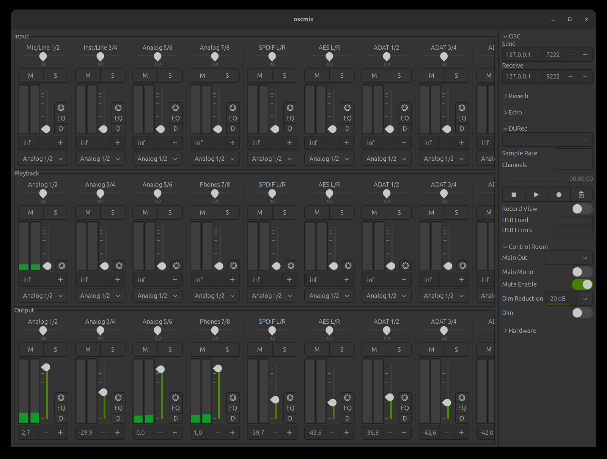

# oscmix-autostart

[](https://github.com/relative23/oscmix-autostart/actions/workflows/ci.yml)
[](LICENSE)

**Plug-and-play RME Fireface UCX II on Linux.** Plug the interface in, the
mixer backend starts automatically, your routing is applied, and the mixer
GUI is one click away in your app menu. No terminal required after install.

[oscmix] by Michael Forney already does the hard part: it speaks the
Fireface's MIDI SysEx protocol and exposes the hardware mixer via OSC,
with a GTK GUI similar to TotalMix FX. What oscmix deliberately does not
ship is the desktop integration -- and that is exactly what this project
adds:

| Piece | What it does |
|---|---|
| udev rule | starts the backend on hotplug, disables USB autosuspend |
| systemd user service | supervises the backend, restarts it on failure (`Type=notify`: "started" means "audio works") |
| `oscmix-session` | finds the ALSA MIDI port, launches `alsaseqio` + `oscmix`, applies your routing and verifies it against the device state |
| `routing.conf` | your default mixer routing, applied on every start |
| `--pipewire-sinks` | optional: named outputs ("Monitors", "Headphones") in your desktop's sound settings |
| desktop entry + launcher | "RME Fireface Mixer" in the app menu, with sanity checks and notifications |
| `install.sh` | builds oscmix from source and installs everything per-user |

[oscmix]: https://github.com/michaelforney/oscmix


*The upstream oscmix-gtk mixer on a UCX II -- this project makes it a
one-click, always-configured part of your desktop.*

## Why you want this

Out of the box, the UCX II works as a class-compliant USB audio device on
Linux (`snd-usb-audio`), but the hardware mixer is a black box: whether you
hear anything depends on whatever routing state the device happens to be
in. PipeWire also maps the 8 analog outputs as "7.1 surround", so stereo
audio only reaches outputs 1/2 -- if your monitors are connected elsewhere,
you get silence.

oscmix-autostart makes the state predictable: every time the device is
plugged in or the machine boots, the routing you declared in a small config
file is applied to the hardware mixer. Zero-latency hardware routing,
independent of the audio server.

## Requirements

- Linux with systemd and udev (any mainstream distro)
- Python >= 3.9 (standard library only)
- To build oscmix: `git`, `make`, a C compiler, `pkg-config`,
  ALSA headers, and GTK 3 headers for the GUI

  ```sh
  # Debian/Ubuntu
  sudo apt install build-essential git pkg-config libasound2-dev \
                   libgtk-3-dev libglib2.0-dev-bin
  # Fedora
  sudo dnf install gcc make git pkgconf-pkg-config alsa-lib-devel gtk3-devel
  # Arch
  sudo pacman -S --needed base-devel git alsa-lib gtk3
  ```

## Install

```sh
git clone https://github.com/relative23/oscmix-autostart
cd oscmix-autostart
./install.sh
```

The installer builds oscmix from upstream, installs everything into
`~/.local` / `~/.config`, and asks for sudo once -- only for the udev rule
in `/etc/udev/rules.d/`. Run `./install.sh --no-udev` for a fully rootless
install (you lose hotplug autostart; the launcher still starts the backend
on demand). Existing files are backed up, an existing `routing.conf` is
never overwritten.

Then plug in the Fireface (or reboot) and open **RME Fireface Mixer** from
the app menu.

## Configure your routing

Edit `~/.config/oscmix/routing.conf`:

```ini
[route:main-out]          # headphones on the front panel
playback = 1/2
output = 1/2

[route:monitors]          # speakers on rear outputs 5/6
playback = 1/2
output = 5/6
level = 0.0               # mix gain in dB (0 = unity, -65 = mute)
volume = 0.0              # optional hardware output volume in dB
```

Apply with `systemctl --user restart oscmix.service`. Mono routes
(`playback = 3` / `output = 7`) work too. PipeWire and PulseAudio send
stereo audio to playback channels 1/2, so most setups only route 1/2 to
wherever their speakers are connected.

Changes made live in the mixer GUI stay active until the next backend
start; the config is your reproducible baseline. Shortly after startup,
`oscmix-session` also reads the state back from the device in the
background and re-sends once on mismatch -- the journal line `routing
verified against device state` is your proof that the hardware is
actually configured.

## Named outputs in your sound settings (PipeWire)

PipeWire presents the Fireface's analog outputs as a single "7.1
surround" device. If you would rather pick "Monitors" or "Headphones" by
name in GNOME/KDE sound settings, generate one virtual sink per stereo
route:

```sh
mkdir -p ~/.config/pipewire/pipewire.conf.d
oscmix-session --pipewire-sinks > ~/.config/pipewire/pipewire.conf.d/oscmix-sinks.conf
systemctl --user restart pipewire wireplumber
```

Each sink feeds the device playback channels that match the route's
output pair, so those pairs need an identity route (`playback = output`)
in routing.conf -- the generated file contains a ready-to-paste note if
one is missing. The Fireface sink node and its real channel layout are
auto-detected via `pw-dump`, so the mapping is correct in both the
surround and the pro-audio/Direct profile; pass
`--pipewire-target <node.name>` to override the detection.

## How it works

```
USB hotplug ── udev rule ── systemd user service ── oscmix-session
                                                        │
                                     ┌──────────────────┼─────────────────┐
                                 finds MIDI       starts alsaseqio    applies routing
                                 client via       + oscmix (OSC ⇆    from routing.conf
                                 /proc/asound     MIDI SysEx)         via OSC/UDP
```

Details, including the failure model and exit-code semantics, are in
[docs/ARCHITECTURE.md](docs/ARCHITECTURE.md). Notes on the OSC interface
oscmix exposes are in [docs/OSC-PROTOCOL.md](docs/OSC-PROTOCOL.md).

## Troubleshooting

```sh
systemctl --user status oscmix.service      # is the backend running?
journalctl --user -u oscmix.service -e      # backend logs
oscmix-session --dry-run                    # what would be started/sent?
```

More in [docs/TROUBLESHOOTING.md](docs/TROUBLESHOOTING.md).

## Other Fireface models

oscmix has (experimental) support for the Fireface 802FS as well. The
device name and USB ID are configurable in `routing.conf` (`[device]`
section); for hotplug you would additionally adapt the IDs in
`udev/90-rme-fireface.rules`. Reports welcome.

## Development

```sh
make test    # pytest unit + integration tests (no hardware needed)
make lint    # shellcheck + Python syntax check
```

The integration tests run `oscmix-session` against a stub backend with a
fake `/proc` and sysfs, so the full startup/routing/shutdown path is tested
without a Fireface attached.

## Uninstall

```sh
./uninstall.sh          # keeps ~/.config/oscmix
./uninstall.sh --purge  # removes the config too
```

## Credits and license

All the actual protocol work happens in [oscmix] (ISC license) -- this
project is just the glue that makes it feel native on a Linux desktop.
oscmix-autostart is MIT licensed, see [LICENSE](LICENSE).
